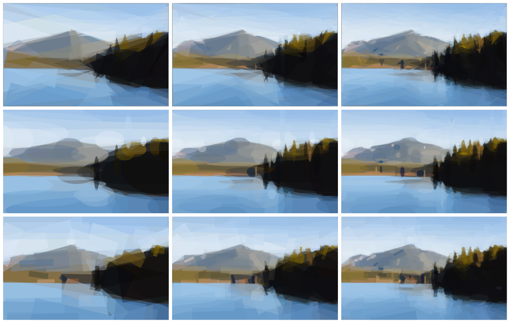

# PicShape
*Making pictures shaped again.*

## Organization

- Project management is done inside each project (ex : https://github.com/PicShape/front/projects/1)

- Each project day start with a Stand-Up to define objectives, talk about new ideas and encountered difficulties.

## Repositories
Organization link : https://github.com/PicShape

Global repository : https://github.com/PicShape/picshape

__Direct GitHub links :__

- Front-End : https://github.com/PicShape/front
- Back-End : https://github.com/PicShape/engine
- Android : https://github.com/PicShape/android

## DevOps tools

 - Travis-CI : https://travis-ci.org/PicShape
 - Heroku
   - https://dashboard.heroku.com/apps/picshape-front
   - https://dashboard.heroku.com/apps/picshape-engine
